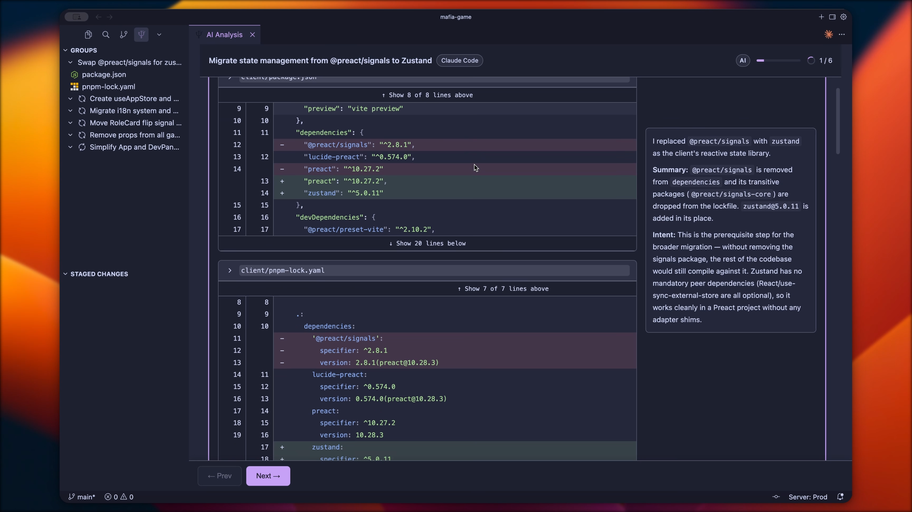

<p align="center">
  
</p>

# Codebrief

[]
[](LICENSE)

> **Review AI code - the smart way**

Codebrief explains the intent behind your AI-generated code changes by gaining context from your coding session — grouping them logically so you can review with ease.



*The Codebrief review panel showing intent-based grouping*

## Quick Start

```bash
# Install in VS Code
code --install-extension MoNazim.codebrief

# Or Cursor
cursor --install-extension MoNazim.codebrief
```

Then: `Cmd/Ctrl+Shift+P` → **"Codebrief: Generate Review"**

---

## The Problem: Reviewing AI Output is Hard

AI coding agents (Claude Code, Codex, Copilot, etc.) can make changes across 20+ files in seconds. 

But then when it comes time to code-review you're left staring at a massive diff wondering things like:

- *Why did it change this file?*
- *What's the relationship between these changes?*
- *Did it do what I actually asked?*

Standard git diffs show files alphabetically. The **intent** is completely hidden. You have to mentally reconstruct the story by jumping between files, burning cognitive energy on detective work instead of actual code review.

## The Solution: AI Explains Its Changes For You

Unlike tools that just read the diff, Codebrief gains context from your coding session to understand *why* changes were made. It then explains them back to you — the way a senior engineer would in a PR review.


*Codebrief explaining a multi-file refactor from Claude Code*

**How it determines intent:**
1. Captures your current git diff (staged or unstaged changes)
2. Gains context from your coding session — including recent commits, branch name, and git history
3. AI analyzes the full context to understand the goal behind the changes
4. Groups changes by logical purpose and generates explanations

*Codebrief knows the story behind your changes.*

Each group includes:
- **What** changed (actions)
- **Why** it changed (intent)

## Features

| Feature | Why It Matters |
|---------|---------------|
| **Intent-based grouping** | See *why* files changed, not just *what* changed |
| **Session-aware analysis** | Knows the context behind your changes, not just the code |
| **Streaming updates** | Watch the analysis build in real-time |
| **Selective staging** | Accept/reject entire intent groups or individual files |
| **Commit message suggestions** | Get a summary of your changes ready to commit |
| **Local & private** | Uses what you use, your code and session data never leave your machine |

## Works With Your AI Agent

Codebrief integrates with the AI tools you already use:

- **Claude Code**
- **OpenCode**
- **Codex**

*More providers coming as demand grows.*

## Usage

### After Your AI Agent Finishes

1. Let your AI agent (Claude, Codex, etc.) make changes
2. Run **"Codebrief: Generate Review"** from Command Palette
3. Review the intent-grouped explanation
4. Stage/unstage groups or files as needed
5. Commit with the AI-suggested message

### Available Commands

| Command | When to Use |
|---------|-------------|
| `Generate Review` | After AI makes changes — understand what happened |
| `Change AI Provider` | Switch between Claude Code, OpenCode, or Codex |
| `Open Log Directory` | Debug issues or report bugs |
| `Reset Configuration` | Start fresh with settings |

## Logs & Debugging

| Platform | Log Location |
|----------|--------------|
| macOS/Linux | `~/.local/share/codebrief/logs/` |
| Windows | `%APPDATA%\Codebrief\logs\` |

Open logs: `Cmd/Ctrl+Shift+P` → **"Codebrief: Open Log Directory"**

### Configuration

```json
{
  "aiCodeReview.logLevel": "info",
  "aiCodeReview.enableFileLogging": true,
  "aiCodeReview.preserveAnalysisJson": true
}
```

## YouTube Demo

[](https://youtu.be/4FSJi-z1bHg)

▶️ **Watch the full demo on [YouTube](https://youtu.be/4FSJi-z1bHg)**

## Development

```bash
npm install
npm run compile
# F5 in VS Code to launch Extension Development Host
```

## License

MIT
